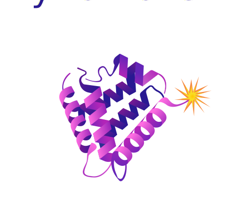
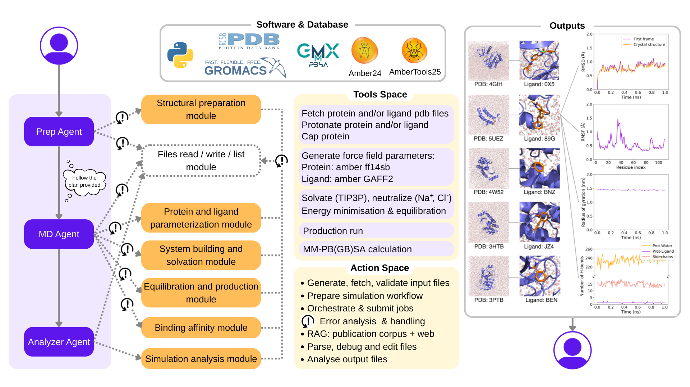

<p align="center">
  
</p>

DynaMate is your reliable ***mate*** that can run molecular ***dyna***mics simulations of protein-ligand and protein-only systems. It is built using LiteLLM and equipt with a collection of tools. Quality checks throughout the pipeline trigger re-tries when something goes wrong, allowing the agent to correct course and save you time on debugging. You can find our preprint [here](https://arxiv.org/abs/2512.10034).

## Key features
* :rocket: Autonomous protein-ligand MD simulations and binding affinity calculations
* :arrows_counterclockwise: Error analysis and correction
* :bar_chart: Binding affinity calculations with MM/PB(GB)SA method

## Software setup
The tools used by the agent require that you have a local installation of the following software. We provide a Docker image with all dependencies pre-installed (recommended), or you can install everything manually if you prefer

### Clone the repository
```bash
git clone https://github.com/schwallergroup/DynaMate.git
cd DynaMate
```

### Docker Setup (Recommended)

1. Build a docker image:
```
docker build -t dynamate -f ./docker/Dockerfile .
```

2. Create an `.env` file to store sensitive data like API keys:

```
OPENROUTER_API_KEY=your_key_here
# Add other keys as needed
```

3. Run the agent:
```
docker run --env-file .env dynamate --pdb-id <pdb-id> --model <model_name>
```

4. Interactive mode (for debugging or exploration):
```
docker run -it --rm --env-file .env dynamate /bin/bash
python main.py --pdb-id <pdb-id> --model <model_name>
```

Happy molecular dynamics simulations! 🧬

### Manual Setup

We recommend that you install in a separate `~/softwares` directory, **not inside the project**:

```bash
mkdir ~/softwares
cd ~/softwares
```

#### 1. CMake
You will need `cmake` locally if you don't have the module available to load directly. 
1. Download the pre-compiled binary from the official site
```bash
wget https://github.com/Kitware/CMake/releases/download/v3.27.8/cmake-3.27.8-linux-x86_64.sh
chmod +x cmake-3.27.8-linux-x86_64.sh
./cmake-3.27.8-linux-x86_64.sh --prefix=$HOME/cmake --skip-license
```
2. Add it to your PATH
```bash
echo 'export PATH=$HOME/cmake/bin:$PATH' >> ~/.bashrc
source ~/.bashrc
```

#### 2. GROMACS
1. Download the source code. You can use `wget` or `curl`:

```bash
wget https://ftp.gromacs.org/pub/gromacs/gromacs-2023.tar.gz
```
You can use a newer version if you want, but IMPORTANT to note:
* To run MM-PB(GB)SA calculations, you will need a GROMACS version inferior than 2023.4.
* The analysis script (/src/scripts/analysis_Gromacs.sh) has been written for GROMACS 2023. You will need to update the echo synthax if you use a different version of GROMACS.
  
2. Unpack the archive
```bash
tar -xvzf gromacs-2023.tar.gz
cd gromacs-2023
```
3. Create a build directory
```bash
mkdir build
cd build
```
4. Make sure `cmake` is in your PATH. If you installed it with `pip`, add it to your PATH
```bash
export PATH=$HOME/.local/bin:$PATH
```
5. Configure the build with GPU support (make sure you have the appropriate CUDA Toolkit for your system)
```bash
cmake .. -DGMX_GPU=on -DGMX_GPU=CUDA -DCMAKE_INSTALL_PREFIX=$HOME/softwares/gromacs-2023
```
6. Build and install
```bash
make -j 4
make install
```
7. Source GROMACS in the current session
```bash
source /usr/local/gromacs/bin/GMXRC
```
8. Verify
```bash
gmx --version
``` 
#### 3. PDBFixer
1. Download the source file
```bash
wget https://github.com/openmm/pdbfixer/archive/refs/tags/v1.11.tar.gz
```
2. Unpack and enter it
```bash
tar -xvzf v1.11.tar.gz
cd pdbfixer-1.11
```
4. Install in editable mode (optional) or normally
```bash
pip install -e .  
```

5. Verify
```bash
python -c "import pdbfixer; print(pdbfixer.__version__)"
```

#### 4. AmberTools25
Navigate [here](https://ambermd.org/GetAmber.php#ambertools) to obtain the source code in tar format. Copy this into the `~/softwares` directory.
1. Unpack the archive
```bash
tar -xvzf ambertools25.tar.bz2
cd ambertools25_src/build
```
2. Run the `cmake` script with MPI and CUDA enabled 
```bash
./run_cmake -DMPI=TRUE -DCUDA=TRUE
```
3. If the cmake build report looks OK, you should now do the following:
```bash
make -j 4
make install
source /home/softwares/ambertools25/amber.sh
```

#### 5. Conda
If you don't have conda, install it
You can use `wget` or `curl`:
```bash
wget "https://github.com/conda-forge/miniforge/releases/latest/download/Miniforge3-$(uname)-$(uname -m).sh"
```

#### 6. Environment setup
Setup the conda env
```bash
conda env create -f environment.yml
```

#### 7. gmx_MMPBSA environment setup
If you wish to perform some MM/PB(GB)SA binding affinity calculations on your MD trajectiries, you need to create another environment to run gmx_MMPBSA (if not using the docker image provided). Installation instructions are available on the [gmx_MMPBSA website](https://valdes-tresanco-ms.github.io/gmx_MMPBSA/dev/installation/).
If using conda, you can create a gmx_MMPBSA conda environment:
```bash 
conda env create -- file path/to/DynaMate/gmx_MMPBSA/env.yml
```
Then, add the path to your gmx_MMPBSA environment in `src/constants.py`:
```bash 
MMPBSA_ENV_DIR = Path("/path/to/miniconda3/envs/gmxMMPBSA/bin/gmx_MMPBSA")
```

#### 8. Activate your environment
```bash
conda activate dynamate
```

#### 9. Export python path so you can load the modules
At the root of the project run:
```bash
export PYTHONPATH=.
```

#### 10. Run the setup script
After setting up your project environment, make sure to run the setup script if you don't want to load gromacs each time. This will load both the environment and the softwares
```bash
source setup.sh
```
Now you are ready to use DynaMate! 
## Usage
To launch the script specify the PDB (or upload it), possible ligand name, and model name in the command line arguments. For example, to launch the MD run with the protein 5UEZ, ligand 89G, and model GPT-5 mini:
```bash
python main.py --pdb_id 5UEZ --ligand 89G --model openrouter/openai/gpt-5-mini
```

And again, happy molecular dynamics simulations! 🧬

<p align="center">
  
</p>

### Citation
If you found this code useful, please consider citing:
```bibtex
@article{guilbert2025dynamate,
  title={DynaMate: An Autonomous Agent for Protein-Ligand Molecular Dynamics Simulations},
  author={Guilbert, Salom{\'e} and Masschelein, Cassandra and Goumaz, Jeremy and Naida, Bohdan and Schwaller, Philippe},
  journal={arXiv preprint arXiv:2512.10034},
  year={2025}
}
```

### License
This work is licensed under the [MIT License](https://opensource.org/license/mit)
