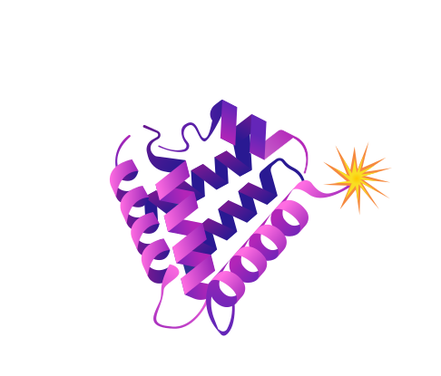
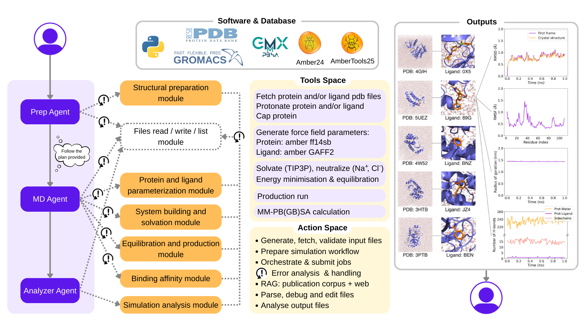

<p align="center">
  
</p>

DynaMate is your reliable ***mate*** that can run molecular ***dyna***mics simulations of protein-ligand and protein-only systems. It is built using LiteLLM and equipped with a collection of tools for the full GROMACS/AMBER workflow. Quality checks throughout the pipeline trigger retries when something goes wrong, allowing the agent to correct course and save you time on debugging. The agent communicates interactively — asking clarifying questions, validating parameters, and answering follow-up questions about results. Successful runs can be distilled into reusable skills via the [upskill](https://github.com/huggingface/upskill) framework, improving the performance of cheaper models on future simulations. You can find our preprint [here](https://arxiv.org/abs/2512.10034).

## Key features
* :rocket: Autonomous protein-ligand MD simulations and binding affinity calculations
* :arrows_counterclockwise: Error analysis and automatic correction with retry logic
* :bar_chart: Binding affinity calculations with MM/PB(GB)SA method
* :speech_balloon: Interactive agent chat — the agent asks clarifying questions and accepts follow-up queries after the pipeline completes
* :sparkles: Upskilling — distill successful runs into reusable skills that improve cheaper/weaker models
* :books: Literature-informed parameters via PaperQA search over your own PDFs

## Software setup
The tools used by the agent require that you have a local installation of the following software. We provide a Docker image with all dependencies pre-installed (recommended), or you can install everything manually if you prefer

### Clone the repository
```bash
git clone https://github.com/schwallergroup/DynaMate.git
cd DynaMate
```

### Docker Setup (Recommended)

1. Build a docker image:
```
docker build -t dynamate -f ./docker/Dockerfile .
```

2. Create an `.env` file to store sensitive data like API keys:

```
OPENROUTER_API_KEY=your_key_here        # Required: used by the MD pipeline via LiteLLM
ANTHROPIC_API_KEY=your_key_here         # Required for upskill generation/refinement (Claude Sonnet 4)
OPENAI_API_KEY=your_key_here            # Optional: used by PaperQA for literature search
```

3. Run the agent:
```
docker run --env-file .env dynamate --model <model_name> --pdb-id <pdb-id> --ligand <ligand-name (optional)> --temp <simulation temperature (K), default: chosen by the agent> --duration <simulation duration (ns), default: chosen by the agent>
```

4. Interactive mode (for debugging or exploration):
```
docker run -it --rm --env-file .env dynamate /bin/bash
python main.py --model <model_name> --pdb-id <pdb-id>
```

Happy molecular dynamics simulations! 🧬

### Manual Setup

We recommend that you install in a separate `~/softwares` directory, **not inside the project**:

```bash
mkdir ~/softwares
cd ~/softwares
```

#### 1. CMake
You will need `cmake` locally if you don't have the module available to load directly. 
1. Download the pre-compiled binary from the official site
```bash
wget https://github.com/Kitware/CMake/releases/download/v3.27.8/cmake-3.27.8-linux-x86_64.sh
chmod +x cmake-3.27.8-linux-x86_64.sh
./cmake-3.27.8-linux-x86_64.sh --prefix=$HOME/cmake --skip-license
```
2. Add it to your PATH
```bash
echo 'export PATH=$HOME/cmake/bin:$PATH' >> ~/.bashrc
source ~/.bashrc
```

#### 2. GROMACS
1. Download the source code. You can use `wget` or `curl`:

```bash
wget https://ftp.gromacs.org/pub/gromacs/gromacs-2023.tar.gz
```
You can use a newer version if you want, but IMPORTANT to note:
* To run MM-PB(GB)SA calculations, you will need a GROMACS version inferior than 2023.4.
* The analysis script (/src/scripts/analysis_Gromacs.sh) has been written for GROMACS 2023. You will need to update the echo synthax if you use a different version of GROMACS.
  
2. Unpack the archive
```bash
tar -xvzf gromacs-2023.tar.gz
cd gromacs-2023
```
3. Create a build directory
```bash
mkdir build
cd build
```
4. Make sure `cmake` is in your PATH. If you installed it with `pip`, add it to your PATH
```bash
export PATH=$HOME/.local/bin:$PATH
```
5. Configure the build with GPU support (make sure you have the appropriate CUDA Toolkit for your system)
```bash
cmake .. -DGMX_GPU=on -DGMX_GPU=CUDA -DCMAKE_INSTALL_PREFIX=$HOME/softwares/gromacs-2023
```
6. Build and install
```bash
make -j 4
make install
```
7. Source GROMACS in the current session
```bash
source /usr/local/gromacs/bin/GMXRC
```
8. Verify
```bash
gmx --version
``` 
#### 3. PDBFixer
1. Download the source file
```bash
wget https://github.com/openmm/pdbfixer/archive/refs/tags/v1.11.tar.gz
```
2. Unpack and enter it
```bash
tar -xvzf v1.11.tar.gz
cd pdbfixer-1.11
```
4. Install in editable mode (optional) or normally
```bash
pip install -e .  
```

5. Verify
```bash
python -c "import pdbfixer; print(pdbfixer.__version__)"
```

#### 4. AmberTools25
Navigate [here](https://ambermd.org/GetAmber.php#ambertools) to obtain the source code in tar format. Copy this into the `~/softwares` directory.
1. Unpack the archive
```bash
tar -xvzf ambertools25.tar.bz2
cd ambertools25_src/build
```
2. Run the `cmake` script with MPI and CUDA enabled 
```bash
./run_cmake -DMPI=TRUE -DCUDA=TRUE
```
3. If the cmake build report looks OK, you should now do the following:
```bash
make -j 4
make install
source /home/softwares/ambertools25/amber.sh
```

#### 5. Conda
If you don't have conda, install it
You can use `wget` or `curl`:
```bash
wget "https://github.com/conda-forge/miniforge/releases/latest/download/Miniforge3-$(uname)-$(uname -m).sh"
```

#### 6. Environment setup
Setup the conda env
```bash
conda env create -f environment.yml
```

#### 7. gmx_MMPBSA environment setup
If you wish to perform some MM/PB(GB)SA binding affinity calculations on your MD trajectiries, you need to create another environment to run gmx_MMPBSA (if not using the docker image provided). Installation instructions are available on the [gmx_MMPBSA website](https://valdes-tresanco-ms.github.io/gmx_MMPBSA/dev/installation/).
If using conda, you can create a gmx_MMPBSA conda environment:
```bash 
conda env create -f path/to/DynaMate/gmx_MMPBSA/env.yml
```
Then, add the path to your gmx_MMPBSA environment in `src/constants.py`:
```bash 
MMPBSA_ENV_DIR = Path("/path/to/miniconda3/envs/gmxMMPBSA/bin/gmx_MMPBSA")
```

#### 8. Activate your environment
```bash
conda activate dynamate
```

#### 9. Export python path so you can load the modules
At the root of the project run:
```bash
export PYTHONPATH=.
```

#### 10. Run the setup script
After setting up your project environment, make sure to run the setup script if you don't want to load gromacs each time. This will load both the environment and the softwares
```bash
source setup.sh
```
Now you are ready to use DynaMate!
## Usage
To launch the script specify the model name in the command line arguments. For example, to launch the agent with GPT-5 mini:
```bash
python main.py --model openrouter/openai/gpt-5-mini
```
You can optionally specify:
```
--pdb-id <4-character PDB ID, default: agent asks interactively>
--ligand <3-letter ligand code; omit for protein-only simulation>
--temp <simulation temperature (K), default: chosen by the agent>
--duration <simulation duration (ns), default: chosen by the agent>
--upskill <export agent trace on success for skill generation>
--model-supports-system-messages <set to False for models without system message support, default: True>
```

### Interactive workflow

When `--pdb-id` is omitted, the PrepAgent will interactively ask you for a PDB ID and (optionally) a ligand code, validate your input, and confirm before proceeding. The agent may also ask clarifying questions about simulation parameters.

After the MD pipeline completes, the MDAgent enters a chat mode where you can ask follow-up questions about the results (e.g. interpreting the RMSD plot). Press Enter on an empty line to finish the session.

### Pipeline overview

1. **PrepAgent** — Fetches and prepares the PDB structure, identifies ligands, searches your literature (if `my_papers/` exists), and generates a simulation plan with parameters.
2. **MDAgent** — Executes the full GROMACS/AMBER workflow: PDB preparation, ligand parameterization (if applicable), topology building with tleap, energy minimization, NVT/NPT equilibration, production MD (default 0.1 ns), and trajectory analysis (RMSD, RMSF, radius of gyration, hydrogen bonds). Results are saved to `analysis.txt`. If any step fails, the agent analyzes the error and retries with corrected inputs.

And again, happy molecular dynamics simulations! 🧬

<p align="center">
  
</p>

## Upskilling

DynaMate supports an upskilling workflow that distills knowledge from successful agent runs into reusable skills, improving the performance of weaker or cheaper models on future runs.

Skills are generated using [upskill](https://github.com/huggingface/upskill)'s Python API and require an `ANTHROPIC_API_KEY` in your `.env` file (separate from the `OPENROUTER_API_KEY` used for running the pipeline).

### How it works

1. **Run the pipeline** with a capable model and pass `--upskill` to export the agent trace automatically on success:
```bash
python main.py --model openrouter/openai/gpt-5-mini --pdb-id 6JJ3 --upskill
```

2. **Generate a skill** from the exported trace:
```bash
python generate_skill.py
```
This extracts error-recovery patterns from the trace (tool failures and how the agent resolved them) and passes them as concrete examples to upskill's `generate_skill()` API. The resulting skill is saved under `skills/` and automatically injected into both the PrepAgent and MDAgent system prompts on all future runs. Multiple skill files accumulate — the agent benefits from all of them (newest first, up to ~4000 tokens total).

3. **Evaluate skill impact** by running a baseline vs. skilled comparison on one or more test systems. Each system independently selects protein-only or protein-ligand evaluation criteria:
```bash
python generate_skill.py --eval-only \
  --compare-systems 6JJ3_None 1FDH_None \
  --compare-model openrouter/anthropic/claude-haiku-4-5
```
This runs the full pipeline twice per system (without skill, then with skill) and prints a step-by-step comparison table with completion ratios and a delta score. If the skilled run does not complete successfully, the skill is automatically refined based on the failed steps and saved. You can optionally fix the simulation parameters to keep evaluation runs consistent:
```bash
python generate_skill.py --eval-only \
  --compare-systems 1J37_None \
  --compare-model openrouter/openai/gpt-4.1-mini \
  --compare-temp 300 --compare-duration 0.01
```
If `--compare-temp` and `--compare-duration` are omitted, PrepAgent chooses them automatically.

4. **Score an existing run** against expected output files without re-running the agent:
```bash
python generate_skill.py --eval-only \
  --eval-systems "6JJ3_None:sandbox/run_20260310_121949"
```

### Evaluation criteria

Success is measured by non-empty output files in the sandbox directory. The expected files differ by system type:

- **Protein-only**: preparation → tleap → GROMACS equilibration → production → analysis
- **Protein-ligand**: preparation → ligand parameterization → tleap → GROMACS equilibration → production → analysis

Each pipeline step is scored independently (0.0–1.0), with an overall score and a `pipeline_successful` flag (all steps == 1.0).

### generate_skill.py options

| Argument | Default | Description |
|----------|---------|-------------|
| `--run-index` | `-1` | Which run to use from the log (0 = first, -1 = last) |
| `--skill-name` | `md-run-<timestamp>` | Name for the generated skill directory |
| `--eval-only` | False | Skip generation; run evaluation only |
| `--compare-systems` | `[]` | Systems for baseline vs. skilled comparison (`PDBID_LIGAND` or `PDBID_None`) |
| `--compare-model` | default model | Model to use for comparison runs |
| `--compare-temp` | None | Fixed temperature for comparison runs (K) |
| `--compare-duration` | None | Fixed duration for comparison runs (ns) |
| `--eval-systems` | `[]` | Score an existing sandbox: `PDBID_LIGAND:path/to/sandbox` |
| `--eval-model` | `[]` | Run legacy upskill Q&A eval on a model (not recommended for MD) |
| `--eval-runs` | `3` | Number of runs for legacy Q&A eval |

### Paper search

If you have a `my_papers/` directory containing relevant PDFs, the PrepAgent can search them to inform simulation parameters. An `OPENAI_API_KEY` is required for this feature (used by PaperQA for embeddings and retrieval). Add it to your `.env` file:
```
OPENAI_API_KEY=your_key_here
```
The first run indexes all PDFs and caches them in `my_docs.pkl` for fast subsequent queries.

## Citation
If you found this code useful, please consider citing:
```bibtex
@article{guilbert2025dynamate,
  title={DynaMate: An Autonomous Agent for Protein-Ligand Molecular Dynamics Simulations},
  author={Guilbert, Salom{\'e} and Masschelein, Cassandra and Goumaz, Jeremy and Naida, Bohdan and Schwaller, Philippe},
  journal={arXiv preprint arXiv:2512.10034},
  year={2025}
}
```

## License
This work is licensed under the [MIT License](https://opensource.org/license/mit)
